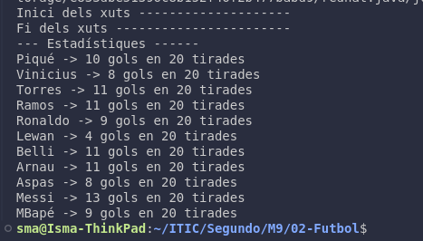

# 02-Futbol

## Part 1

La classe *`Futbolista`* és una extensió de la classe *`Thread`*, que permet tractar cada jugador com un fil independent. L'objectiu del programa és simular un partit on onze jugadors tiren penals. Cada jugador té 20 oportunitats per marcar gol, amb una probabilitat del *50%* d'encertar en cada tir.

### Exemple de resultat:

## Part 2

En aquesta part, es demostra que *tots els programes en Java s’executen dins d’un fil*. Es crea una classe anomenada `MainDemoFil` que captura informació sobre el fil principal d'execució (`main thread`). Aquesta classe mostra detalls com el nom, la prioritat i l'estat del fil utilitzant mètodes de la classe `Thread`.

### Exemple de sortida:
